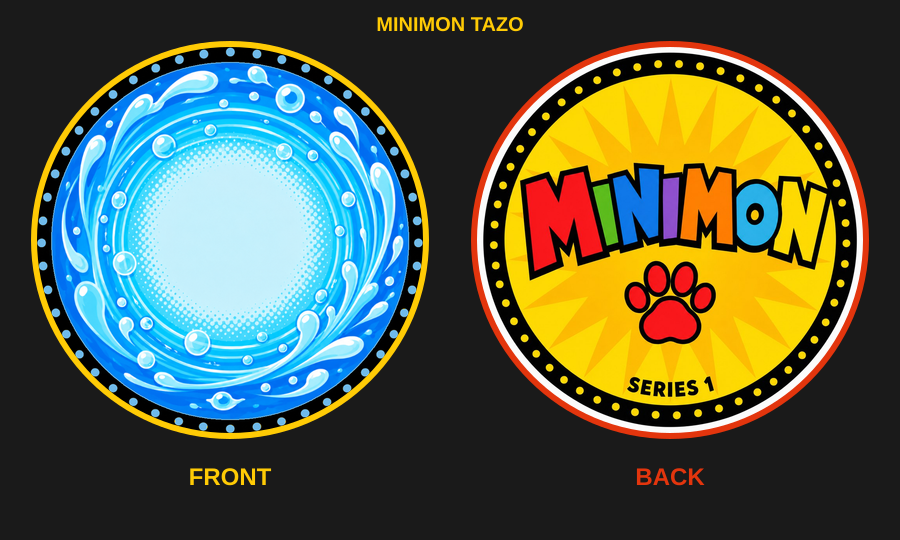
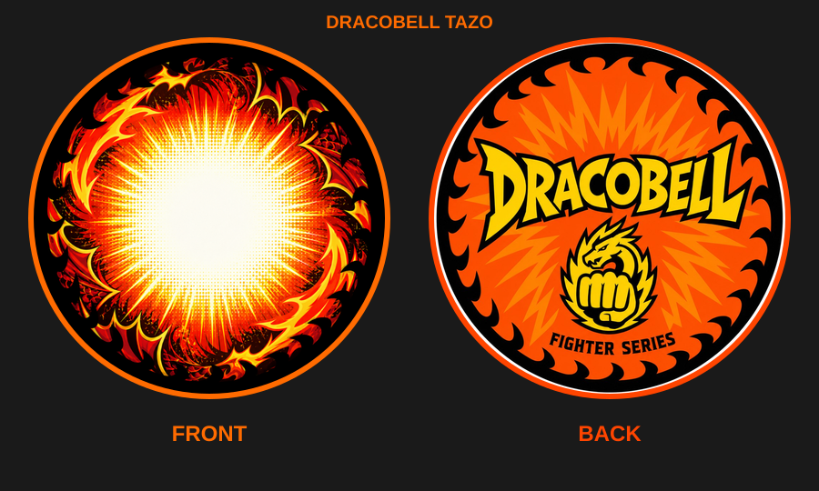
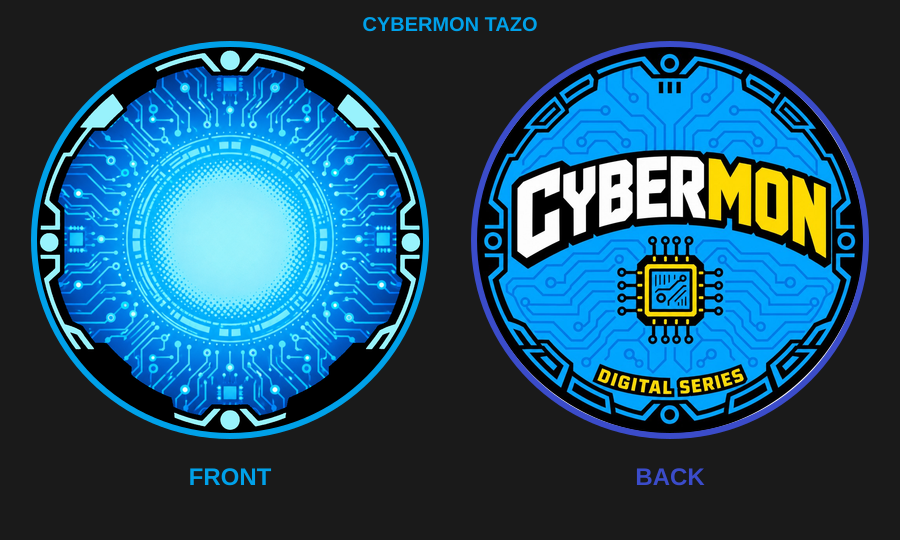
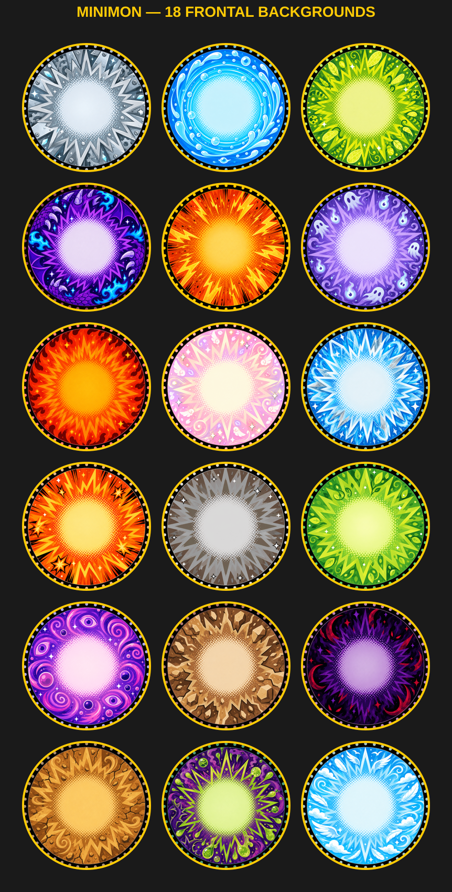
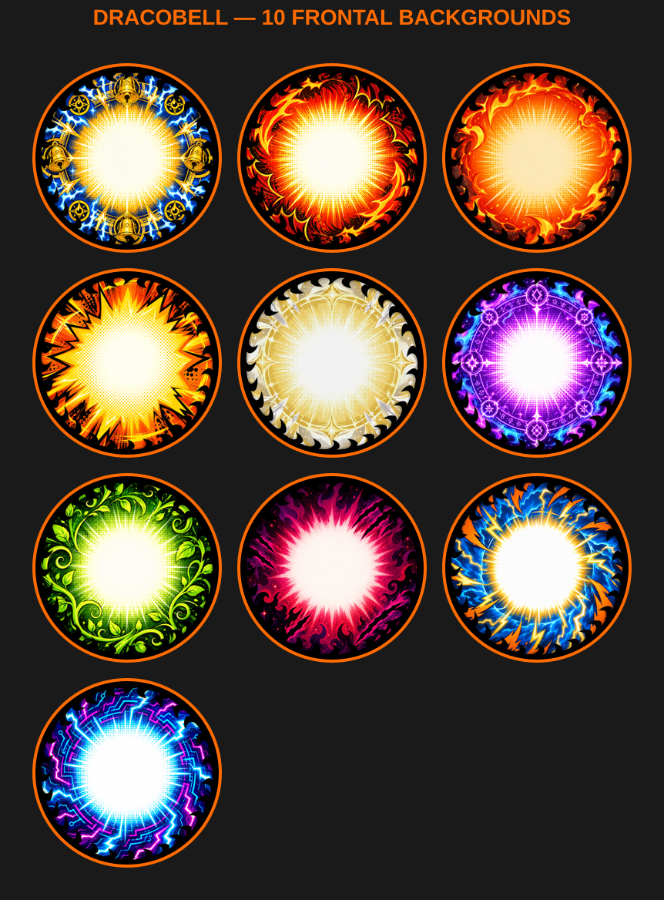
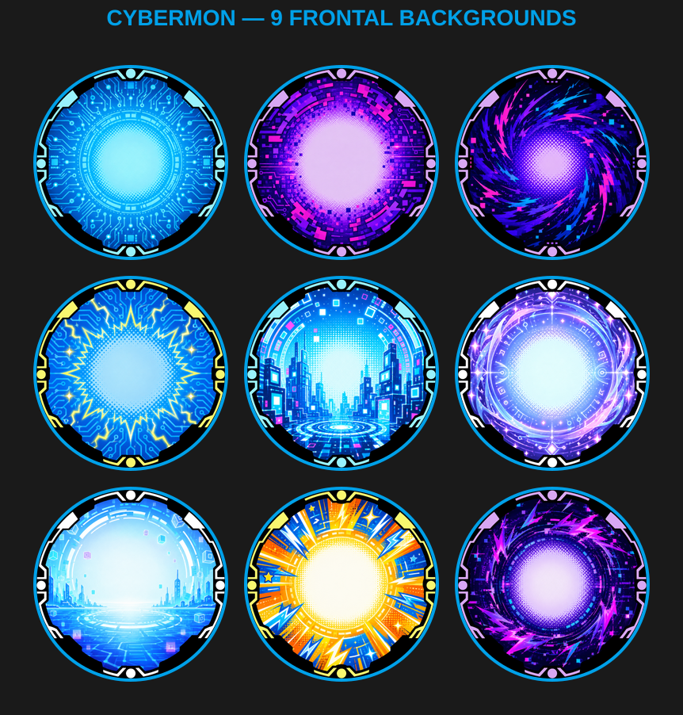
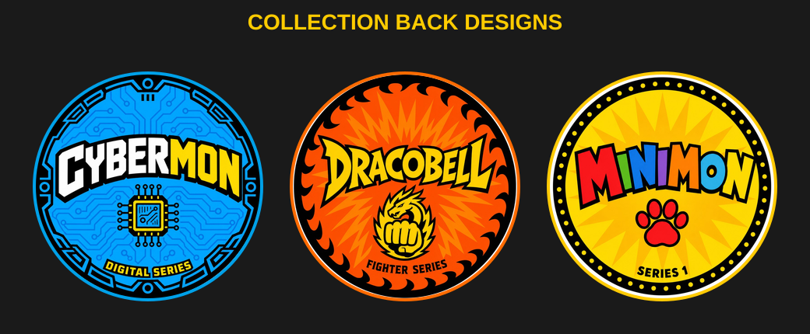
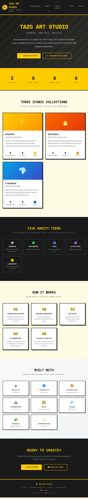

<div align="center">

# 🎴 Tazo Art Studio

**AI-Powered Tazo Art Creator for Trading Tazos Game**

_Create. Collect. Battle._

[](https://nextjs.org/)
[](https://www.typescriptlang.org/)
[](https://tailwindcss.com/)
[](https://www.prisma.io/)
[](./LICENSING)
[](https://smouj.github.io/tazo-art-studio/)

</div>

---

## 📖 Overview

**Tazo Art Studio** is a web application for generating, collecting, and managing AI-created tazo art cards across TTG's three original Season 1 franchises. Each tazo features an AI-generated character composited onto circular tazo backgrounds with full front-and-back designs.

> 🔗 **Related Project:** [Trading Tazos Game](https://github.com/smouj/Trading-Tazos-Game) — The original game this studio creates art for. Generate characters here, battle them there!

---

## 🎴 What Does a Tazo Look Like?

Each tazo is a **circular collectible disc** with two sides — much like the classic 90s tazos/pogs:

| | **Front (Composited)** | **Back (Collection Design)** |
|---|---|---|
| The AI-generated character is composited onto a real tazo frontal background | Unique back artwork per collection |

### Minimon — Elemental Creatures

<p align="center">
  
</p>

### Dracobell — Mystic Fighters

<p align="center">
  
</p>

### Cybermon — Digital Entities

<p align="center">
  
</p>

---

## 🖼️ Frontal Backgrounds

Each collection features unique circular backgrounds where AI characters are composited onto. The backgrounds are actual PNG assets giving each tazo its authentic 90s aesthetic.

### Minimon — 18 Elemental Backgrounds

<p align="center">
  
</p>

### Dracobell — 10 Mystic Aura Backgrounds

<p align="center">
  
</p>

### Cybermon — 9 Digital Realm Backgrounds

<p align="center">
  
</p>

### Collection Back Designs

Each collection has its own back-side tazo design:

<p align="center">
  
</p>

---

## ✨ Features

### 🎨 AI-Powered Generation
- Describe your tazo character and let AI generate the art
- **Automatic compositing** of AI characters onto real tazo backgrounds using Sharp
- Custom prompt support for advanced users
- Random preset descriptions for quick inspiration
- Built-in **transparency validation** — ensures characters have clean alpha channels

### 🗂️ Three Iconic Collections

| Collection | Inspiration | Backgrounds | Color | Theme |
|-----------|------------|-------------|-------|-------|
| **Minimon** | Elemental lineage creatures | 18 frontal BGs | Yellow/Orange | 18 types: Acero, Agua, Bicho, Dragón, Eléctrico, Fantasma, Fuego, Hada, Hielo, Lucha, Normal, Planta, Psíquico, Roca, Siniestro, Tierra, Veneno, Volador |
| **Dracobell** | Bellora mystic fighters | 10 frontal BGs | Orange/Red | 10 auras: Campana, Draco, Fuego, Impacto, Luz, Místico, Naturaleza, Oscuro, Rayo, Tecno |
| **Cybermon** | Neon Grid digital entities | 9 frontal BGs | Blue/Cyan | 9 realms: Base, Burst, Corrupto, Link, Lugar, Nexus, Objeto, Personaje, Villano |

### ⭐ Five Rarity Tiers

| Rarity | Color | Visual Effect |
|--------|-------|---------------|
| **Common** | `#9CA3AF` Gray | Standard clean design |
| **Uncommon** | `#22C55E` Green | Subtle shimmer on character |
| **Rare** | `#3B82F6` Blue | Holographic crystal accents |
| **Ultra-Rare** | `#A855F7` Purple | Purple aura + metallic glow |
| **Legendary** | `#FFCC00` Gold | Golden aura + crown light + particles |

### ⚔️ Eight Combat Roles

```
Attacker · Tank · Technical · Bouncer · Heavy · Light · Balanced · Special
```

Each role determines the distribution of **9 combat stats**:

| Stat | Icon | Description |
|------|------|-------------|
| **ATK** Attack | ⚔️ | Offensive power |
| **DEF** Defense | 🛡️ | Damage reduction |
| **RES** Resistance | 🛡️ | Status effect resistance |
| **WGT** Weight | 🏋️ | Knockback resistance |
| **STB** Stability | ⚓ | Recovery speed |
| **SPN** Spin | 🔄 | Spin attack power |
| **CTR** Control | 🎯 | Accuracy |
| **BNC** Bounce | ↕️ | Jump/mobility |
| **PRC** Precision | 🎯 | Critical hit chance |

### 🖼️ Gallery & Collection Management
- Browse all created tazos with visual grid
- Filter by collection, rarity, or favorites
- **Flip animation** to see front and back of each tazo
- **Download** tazo images (front, back, or creature-only PNG)
- **Download metadata** as JSON
- Favorite/unfavorite your best designs
- Delete unwanted creations

### 📰 90s Magazine Aesthetic
- Complete design system inspired by **Nintendo Power / Pokémon Magazine**
- Magazine-style shadows, halftone patterns, and bold typography
- Collection-specific gradients and color schemes
- Animated effects for legendary and ultra-rare tazos
- Comic-style stat bars with color-coded values

---

## 📸 App Screenshots

### Landing Page

<p align="center">
  
</p>

> 💡 The full Next.js app (with live AI generation, gallery, and flip animations) requires the `z-ai-web-dev-sdk` API key. See [Getting Started](#-getting-started) to run it locally.

---

## 🛠️ Tech Stack

| Layer | Technology | Purpose |
|-------|-----------|---------|
| **Framework** | [Next.js 16](https://nextjs.org/) (App Router) | Full-stack React framework |
| **Language** | [TypeScript 5](https://www.typescriptlang.org/) | Type-safe development |
| **Styling** | [Tailwind CSS 4](https://tailwindcss.com/) + Magazine Design System | 90s aesthetic UI |
| **UI Components** | [shadcn/ui](https://ui.shadcn.com/) (Radix primitives) | Accessible, composable components |
| **Icons** | [Lucide React](https://lucide.dev/) | Consistent icon set |
| **Image Processing** | [Sharp](https://sharp.pixelplumbing.com/) | Character-to-background compositing + circular masking |
| **AI Generation** | [z-ai-web-dev-sdk](https://www.npmjs.com/package/z-ai-web-dev-sdk) | AI image generation with transparency guard |
| **Database** | [Prisma ORM](https://www.prisma.io/) + SQLite | Persistent storage |
| **Animations** | [Framer Motion](https://www.framer.com/motion/) | Smooth UI transitions + flip card |

---

## 🚀 Getting Started

### Prerequisites

- [Node.js](https://nodejs.org/) 22+ or [Bun](https://bun.sh/) 1.x
- npm, yarn, pnpm, or bun
- A [z-ai-web-dev-sdk](https://www.npmjs.com/package/z-ai-web-dev-sdk) API key

### Installation

```bash
# Clone the repository
git clone https://github.com/smouj/tazo-art-studio.git
cd tazo-art-studio

# Install dependencies
npm install    # or: bun install

# Set up environment variables
cp .env.example .env

# Initialize the database
npx prisma db push    # or: bunx prisma db push

# Start the development server
npm run dev    # or: bun run dev
```

Open [http://localhost:3000](http://localhost:3000) in your browser.

### Environment Variables

| Variable | Description | Default |
|----------|------------|---------|
| `DATABASE_URL` | SQLite database connection string | `file:./dev.db` |

---

## 📁 Project Structure

```
tazo-art-studio/
├── prisma/
│   └── schema.prisma              # TazoArt model with 9 combat stats
├── public/
│   ├── tazo-assets/                # Real tazo background artwork
│   │   ├── frontal/                # Frontal backgrounds per collection
│   │   │   ├── minimon/            # 18 PNG backgrounds (1254×1254)
│   │   │   ├── dracobell/          # 10 PNG backgrounds (1254×1254)
│   │   │   ├── cybermon/           # 9 PNG backgrounds (1254×1254)
│   │   │   └── special/            # Cross-collection legendary BG
│   │   └── back/                   # Back designs per collection
│   │       ├── back-minimon.png
│   │       ├── back-dracobell.png
│   │       └── back-cybermon.png
│   └── examples/                   # README showcase images
│       ├── tazo-*-card.png         # Front+back card examples
│       ├── tazo-*-showcase.png     # Background galleries
│       └── tazo-backs-showcase.png # Back designs showcase
├── docs/
│   └── index.html                  # GitHub Pages landing page
├── src/
│   ├── app/
│   │   ├── page.tsx                # Main SPA (Create Tab + Gallery Tab)
│   │   ├── layout.tsx              # Root layout with fonts & metadata
│   │   ├── globals.css             # Magazine design system + animations
│   │   └── api/
│   │       └── tazo-art/
│   │           ├── route.ts        # GET (list) + POST (create + generate)
│   │           └── [id]/
│   │               └── route.ts    # GET + PATCH (favorite) + DELETE
│   ├── components/ui/              # shadcn/ui components (Radix-based)
│   ├── hooks/                      # Custom React hooks
│   └── lib/
│       ├── db.ts                   # Prisma client singleton
│       └── utils.ts                # Utility functions
├── scripts/
│   └── generate-examples.mjs       # README example image generator
├── .env.example                    # Environment variable template
├── .gitignore
├── LICENSING                         # proprietary License
├── package.json
└── tsconfig.json
```

---

## 🎮 How It Works

### AI Generation Flow

```
User Input → Prompt Builder → AI Image Generation → Transparency Check → Character Compositing → Database Storage
```

1. **User fills in** the form: name, collection, rarity, role, and visual description
2. **API builds a strict prompt** — collection style + rarity effects + role stance + mandatory transparency guard
3. **z-ai-web-dev-sdk** generates a 1024×1024 character illustration with transparent background
4. **Transparency validation** checks all 4 corners of the generated image for alpha channel
5. **Sharp** composites the AI character (65% size) onto a randomly selected frontal background (1254×1254)
6. **Both images** (composited front + raw character) are stored in the database as Base64
7. **Tazo appears** in the gallery with full front/back flip view

### Compositing Process

The character is generated with a transparent background, then composited onto the real tazo background:

```typescript
// Character is resized to 65% of background size
const charSize = Math.round(bgSize * 0.65);
const offset = Math.round((bgSize - charSize) / 2);

// Composited with proper transparency preservation
const composited = await sharp(bgBuffer)
  .composite([{ input: resizedCharacter, left: offset, top: offset }])
  .png()
  .toBuffer();
```

### Stat Generation

Stats are generated based on:
- **Rarity tier** — Higher rarity = higher multiplier (Common: 0.8×, Legendary: 1.25×)
- **Combat role** — Each role has different base stat emphasis:
  - **Attacker:** ATK 80, DEF 35 — pure offense
  - **Tank:** DEF 85, RES 80, WGT 75 — maximum durability
  - **Heavy:** WGT 95, STB 80 — unmovable wall
  - **Light:** WGT 15, BNC 65, PRC 75 — nimble glass cannon
- **Random variance** — ±5 points from calculated value to keep each tazo unique

---

## 🎨 Design System

The application follows a **90s Nintendo Power / Pokémon Magazine** aesthetic:

### Color Palette

| Token | Hex | Usage |
|-------|-----|-------|
| Magazine Yellow | `#FFCC00` | Primary actions, headings, legendary rarity |
| Pokémon Red | `#E3350D` | Destructive actions, alerts, attacker role |
| Pokémon Blue | `#3B4CCA` | Links, accents, tank role |
| Dragon Orange | `#FF6B00` | Dracobell collection |
| Cyber Blue | `#00A1E9` | Cybermon collection |
| Magazine Cream | `#FFFBE6` | Page backgrounds |
| Magazine Black | `#1A1A1A` | Text, borders, headers |

### Typography
- **Headings:** `font-black uppercase tracking-wider`
- **Labels:** `font-bold text-xs uppercase`
- **Body:** `font-bold text-sm`
- **Font stack:** System sans-serif with bold emphasis

### Special CSS Effects

| Class | Effect |
|-------|--------|
| `.mag-card` | Magazine-style card with thick border + shadow offset |
| `.mag-btn` | Bold button with shadow offset + scale on hover |
| `.legendary-glow` | Animated golden glow + particles for legendary tazos |
| `.holo-border` | Holographic shimmer for rare+ tazos |
| `.mag-stroke` | Text stroke for readability on images |
| `.tazo-card-hover` | Scale(1.03) + shadow on hover |
| `.mag-stripes` | Diagonal halftone pattern overlay |
| `.stat-bar` | Comic-style progress bar for stats |

---

## 🤝 Contributing

This is a community project — contributions and feedback are appreciated! Please see [CONTRIBUTING.md](./CONTRIBUTING.md) for guidelines.

1. Open an Issue to discuss your idea first
2. Create a feature branch (`git checkout -b feature/amazing-feature`)
3. Commit your changes (`git commit -m 'Add amazing feature'`)
4. Push to the branch (`git push origin feature/amazing-feature`)
5. Open a Pull Request

### Ideas for Contributions
- New collection backgrounds
- Additional rarity tiers or effects
- Export formats (GIF, WebP)
- Batch generation
- WebSocket integration with Trading Tazos Game

---

## 📄 License

This project is licensed under the proprietary License — see the [LICENSING](./LICENSING) file for details.

---

## 🙏 Acknowledgments

- [Trading Tazos Game](https://github.com/smouj/Trading-Tazos-Game) — The original game project
- [z-ai-web-dev-sdk](https://www.npmjs.com/package/z-ai-web-dev-sdk) — AI image generation SDK
- [shadcn/ui](https://ui.shadcn.com/) — Beautiful, accessible UI components
- [Sharp](https://sharp.pixelplumbing.com/) — High-performance image compositing
- The 90s magazine culture that inspired the aesthetic

---

<div align="center">

**[⬆ Back to Top](#-tazo-art-studio)**

Made with ❤️ and 90s nostalgia

</div>
